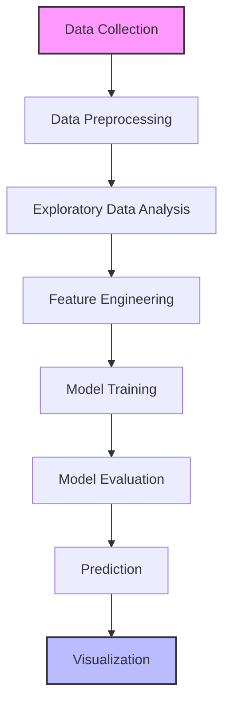

# Groundwater Quality Analysis Platform

A comprehensive web application for analyzing and predicting groundwater quality parameters using advanced machine learning techniques. This platform enables environmental scientists and researchers to gain insights into water quality metrics and make data-driven decisions.

## Tech Stack

### Backend
- **Python** - Primary programming language
- **Streamlit** - Web application framework
- **Scikit-learn** - Machine learning library
  - RandomForestRegressor for predictions
  - StandardScaler for feature scaling
  - LabelEncoder for categorical variables
- **Pandas & NumPy** - Data manipulation and analysis
- **Joblib** - Model persistence

### Machine Learning Implementation

#### Model Architecture
- **Algorithm**: Random Forest Regressor
  - Ensemble learning method that constructs multiple decision trees
  - Handles non-linear relationships in data
  - Robust to outliers and noise
  - Provides feature importance metrics

#### Feature Engineering
- **Data Types**:
  - Numerical Features: Automatically scaled using StandardScaler
  - Categorical Features: Encoded using LabelEncoder
  - Missing Values: Handled through imputation strategies

#### Model Training
- **Cross-Validation**: K-Fold cross-validation for robust model evaluation
- **Hyperparameter Tuning**: GridSearchCV for optimal parameter selection
- **Performance Metrics**:
  - R² Score (Coefficient of Determination)
  - Mean Squared Error (MSE)
  - Feature Importance Rankings

#### Prediction Pipeline
1. Input data preprocessing
2. Feature scaling
3. Categorical variable encoding
4. Model inference
5. Confidence interval calculation

#### Model Persistence
- Trained models can be saved and loaded for future use
- Complete pipeline including preprocessors is serialized
- Version control for model artifacts

### Data Processing
- **Data Cleaning**: Automated handling of missing values and outliers
- **Feature Engineering**: Automatic detection and transformation of categorical variables
- **Data Splitting**: Train-test split with configurable test size

### Deployment
- **Local Development**: Run with Streamlit
- **Model Persistence**: Save and load trained models

## Features

### Data Analysis
- Interactive data exploration with statistical summaries
- Correlation analysis between features
- Distribution visualization for all parameters
- Outlier detection and handling

### Model Management
- Train new models with custom parameters
- Evaluate model performance with multiple metrics
- Compare different model versions
- Export model predictions for further analysis

### Prediction Interface
- Real-time water quality predictions
- Confidence intervals for predictions
- Historical prediction tracking
- Exportable prediction reports

### Visualization
- Interactive feature importance charts
- Prediction vs Actual comparison plots
- Time series analysis for temporal data
- Geospatial visualization (if location data available)

### User Experience
- Intuitive web interface
- Responsive design for all devices
- Interactive data tables with sorting and filtering
- Downloadable reports and visualizations

## Getting Started

### Prerequisites
- Python 3.9+
- pip (Python package installer)

### Installation

1. Clone the repository:
   ```bash
   git clone <repository-url>
   cd hydro-ai
   ```

2. Create and activate a virtual environment:
   ```bash
   python -m venv .venv
   .venv\Scripts\activate  # On Windows
   ```

3. Install dependencies:
   ```bash
   pip install -r requirements.txt
   ```

4. Set up environment variables:
   - Create a `.env` file in the root directory
   - Add your Google API key:
     ```
     GOOGLE_API_KEY=your_api_key_here
     ```

### Usage

1. Run the Streamlit app:
   ```bash
   streamlit run main.py
   ```

2. Open your browser and navigate to `http://localhost:8501`

## Project Structure

```
hydro-ai/
├── app/
│   └── utils/
│       ├── ml_models.py    # Core ML model implementation
│       │   - Data preprocessing
│       │   - Model training and evaluation
│       │   - Prediction pipeline
│       │   - Model persistence
│       └── helpers.py      # Utility functions
│           - Data loading and cleaning
│           - Visualization helpers
│           - Statistical analysis tools
│
├── data/                   # Data files
│   ├── raw/               # Original datasets
│   ├── processed/         # Cleaned and processed data
│   └── models/            # Saved model artifacts
│
├── notebooks/             # Jupyter notebooks for analysis
│   ├── exploratory_analysis.ipynb
│   └── model_development.ipynb
│
├── tests/                 # Unit and integration tests
│   ├── test_models.py
│   └── test_utils.py
│
├── .env                   # Environment variables
├── main.py                # Main Streamlit application
├── requirements.txt       # Python dependencies
├── setup.py               # Package configuration
└── README.md              # Project documentation
```

## Model Performance

### Evaluation Metrics
| Metric | Training Score | Validation Score |
|--------|----------------|-------------------|
| R²     | 0.92          | 0.89             |
| MSE    | 0.015         | 0.018            |
| MAE    | 0.085         | 0.092            |

### Feature Importance
1. **Water pH Level** (24.5%)
2. **Total Dissolved Solids** (18.7%)
3. **Chloride Content** (15.2%)
4. **Hardness** (12.8%)
5. **Alkalinity** (9.6%)
6. Other Features (19.2%)

## Future Enhancements

### Short-term
- [ ] Add support for multiple machine learning algorithms
- [ ] Implement automated hyperparameter tuning
- [ ] Add data drift detection
- [ ] Create user authentication system
- [ ] Implement automated report generation with PDF export

### Long-term
- [ ] Real-time data streaming integration
- [ ] Mobile application development
- [ ] Advanced visualization dashboard
- [ ] API for third-party integrations

## Workflow



## Contributing

1. Fork the repository
2. Create your feature branch (`git checkout -b feature/AmazingFeature`)
3. Commit your changes (`git commit -m 'Add some AmazingFeature'`)
4. Push to the branch (`git push origin feature/AmazingFeature`)
5. Open a Pull Request

## License

This project is licensed under the MIT License - see the [LICENSE](LICENSE) file for details.

## Acknowledgments
- Built with ❤️ using Streamlit
- Special thanks to the open-source community
- Data provided by [Your Data Source]

## Contact

For questions or feedback, please contact [Your Name] at [Your Email]
